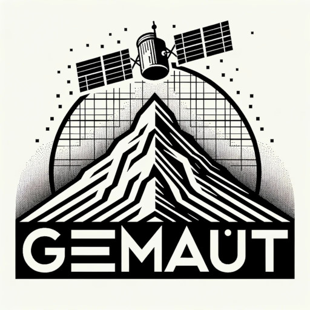

<p align="center">
  
  
</p>

# 🚀 GEMAUT - Génération de Modèles Automatiques de Terrain

**L'outil Open Source pour le passage MNS > MNT Haute Résolution développé au Service de l'Imagerie Spatiale de l'IGN 🚀 **

## 📖 Description / Publication

GEMAUT est décrit en détail dans cette article publié dans la *Revue Française de Photogrammétrie et de Télédétection (RFPT)* :

> 👉 [Lire l'article sur le site de la RFPT](https://rfpt.sfpt.fr/index.php/RFPT/article/view/739)

Si vous utilisez GEMAUT dans vos travaux, merci de citer cette publication.

## ✨ Nouvelles fonctionnalités

- **⚙️ Calcul automatique de masques** avec `--auto-mask`
- **🎯 Choix de méthode** : PDAL (par défaut) ou SAGA avec `--mask-method`
- **📋 Configuration simplifiée** : Utilisation d'un fichier de configuration YAML
- **🧪 Tests unitaires complets** : Suite de tests automatisés pour validation
- **🚀 Interface utilisateur simplifiée** : Commande `gemaut` pour une utilisation optimisée

---

## 🏗️ Installation

### Méthode recommandée : Installation via pip

```bash
# Cloner le dépôt
git clone https://github.com/IGNF/GEMAUT-pipeline.git
cd GEMAUT-pipeline

# Créer et activer un environnement conda (avec outils de compilation)
conda env create -f gemaut_env.yml
conda activate gemaut_env

# 1. Installer les dépendances externes (SAGA + GEMO)
./scripts/install_deps.sh

# 2. Recharger l'environnement
conda deactivate && conda activate gemaut_env

# 3. Installer GEMAUT
pip install .
```

### Méthode alternative : Script bash complet

```bash
# Cloner le dépôt
git clone https://github.com/IGNF/GEMAUT-pipeline.git
cd GEMAUT-pipeline

# Créer l'environnement conda & l'activer
conda env create -f gemaut_env.yml
conda activate gemaut_env

# Lancer l'installation complète
./scripts/install_gemaut.sh
```

📖 **Pour plus de détails**, consultez [docs/INSTALL.md](docs/INSTALL.md)
---

## 🎯 Utilisation

### 1. Activer l'environnement
```bash
conda activate gemaut_env
```

### 2. Aide du script
```bash
gemaut --help
```

### 3. Exemples d'utilisation

#### **Calcul automatique de masque avec PDAL (par défaut)**
```bash
gemaut \
    --mns /chemin/vers/MNS_in.tif \
    --out /chemin/vers/MNT.tif \
    --reso 4 \
    --cpu 24 \
    --RepTra RepTra \
    --auto-mask
    # PDAL est utilisé par défaut (pas besoin de --mask-method pdal)
```

#### **Calcul automatique de masque avec SAGA**
```bash
gemaut \
    --mns /chemin/vers/MNS_in.tif \
    --out /chemin/vers/MNT_SAGA.tif \
    --reso 4 \
    --cpu 24 \
    --RepTra RepTra_SAGA \
    --auto-mask \
    --mask-method saga
```

#### **Utilisation traditionnelle avec un masque fourni par l'utilisateur**
```bash
gemaut \
    --mns /chemin/vers/MNS_in.tif \
    --out /chemin/vers/MNT.tif \
    --reso 4 \
    --cpu 24 \
    --RepTra /chemin/vers/RepTra \
    --masque /chemin/vers/masque.tif \
    --nodata_ext -32768 \
    --nodata_int -32767
```

#### **Utilisation avec fichier de configuration**
```bash
gemaut \
    --config ./examples/configs/config_exemple.yaml
```

---

## 🔧 Paramètres

### Paramètres obligatoires
- `--mns` : MNS d'entrée
- `--out` : MNT de sortie
- `--reso` : Résolution du MNT en sortie
- `--cpu` : Nombre de CPUs à utiliser
- `--RepTra` : Répertoire de travail

### **Nouveaux paramètres de masque automatique**
- `--auto-mask` : Activer le calcul automatique de masque
- `--mask-method` : Méthode de calcul (`saga`, `pdal`, ou `auto`=`saga` si disponible)

### Paramètres optionnels
- `--masque` : Masque sol/sursol (ignoré si `--auto-mask` est activé)
- `--groundval` : Valeur du masque pour le sol (défaut: 0)
- `--init` : Initialisation (par défaut le MNS)
- `--nodata_ext` : Valeur du no_data sur les bords de chantier (défaut: -32768)
- `--nodata_int` : Valeur du no_data pour les trous intérieurs (défaut: -32767)
- `--sigma` : Précision du Z MNS (défaut: 0.5)
- `--regul` : Rigidité de la nappe (défaut: 0.01)
- `--tile` : Taille de la tuile (défaut: 300)
- `--pad` : Recouvrement entre tuiles (défaut: 120)
- `--norme` : Choix de la norme (défaut: hubertukey)
- `--clean` : Supprimer les fichiers temporaires

---

## 📁 Structure des données

### MNS d'entrée
Le MNS d'entrée doit avoir des valeurs de no_data différentes pour :
- **Bords de chantier** (`--nodata_ext`, défaut: -32768)
- **Trous intérieurs** (`--nodata_int`, défaut: -32767) où la corrélation a échoué

### Masques générés
- **Résolution** : Identique au MNS d'entrée
- **Format** : Binaire (0 = sol, 1 = sursol)
---

## Configuration avancée

### Paramètres SAGA
```yaml
saga:
  radius: 100.0        # Rayon de recherche
  tile: 100            # Taille des dalles
  pente: 15.0          # Pente maximale
```

### Paramètres PDAL
```yaml
pdal:
'csf::iterations': 500 [Default: 500]
'csf::threshold': 0.8 [Default: 0.5]
'csf::resolution': 2.0 [Default: 1.0]
'csf::step': 0.8 [Default: 0.65]
'csf::rigidness': 5 [Default: 3]
'csf::hdiff': 0.2 [Default: 0.3] 
'csf::smooth': True [Default: true]
```

---

## Contribution

1. Fork le projet
2. Créer une branche feature (`git checkout -b feature/AmazingFeature`)
3. Commit les changements (`git commit -m 'Add AmazingFeature'`)
4. Push vers la branche (`git push origin feature/AmazingFeature`)
5. Ouvrir une Pull Request

---

## Licence

Ce projet est sous la licence [LICENSE](LICENSE).

---
